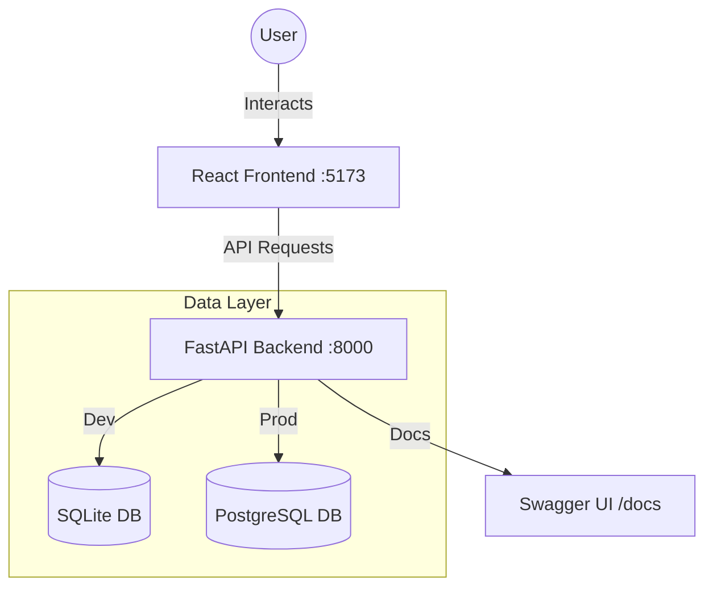

# HRMS Lite - Human Resource Management System

A modern, high-fidelity Human Resource Management System built with FastAPI and React.

## 🚀 Overview

HRMS Lite is designed for efficiency and aesthetics. It features a responsive dashboard, employee directory, and automated attendance tracking with server-side pagination and real-time filtering.

---

## �️ System Architecture



---

## 🛠️ Zero-to-Hero: Fresh Setup Guide

Follow these steps if you are setting up this project on a brand new computer.

### Step 1: Install Prerequisites

Before you begin, ensure you have the following installed:
1.  **Python 3.10+**: [Download Python](https://www.python.org/downloads/) (Make sure to check "Add Python to PATH" during installation).
2.  **Node.js 20 or above**: [Download Node.js](https://nodejs.org/) (Includes `npm`).
3.  **Git**: [Download Git](https://git-scm.com/downloads).

### Step 2: Clone the Project
Open your terminal (Command Prompt, PowerShell, or Terminal) and run:
```bash
git clone <your-repo-url>
cd HRMS
```

### Step 3: Backend Setup
```bash
cd hrms-backend

# 1. Create a virtual environment
python -m venv venv

# 2. Activate the environment
# On Windows:
.\venv\Scripts\activate
# On macOS/Linux:
source venv/bin/activate

# 3. Install all required libraries
pip install -r requirements.txt

# 4. Start the backend
uvicorn app.main:app --reload
```
*The backend is now running at [http://127.0.0.1:8000](http://127.0.0.1:8000)*

### Step 4: Frontend Setup
Open a **new terminal window**, navigate to the project root, and run:
```bash
cd hrms-frontend

# 1. Install all dependencies
npm install

# 2. Start the development server
npm run dev
```
*The website is now live at [http://localhost:5173](http://localhost:5173)*

---

## 🏗️ Environments & Configuration

The system is pre-configured to work out of the box with **SQLite** (Development Mode). 

### How to switch to Production (PostgreSQL):
1.  Open `hrms-backend/app/core/config.py`.
2.  Change `ENVIRONMENT` to `"prod"`.
3.  Change `env_file` to `".env.prod"`.
4.  Ensure your `DATABASE_URL` in `.env.prod` is correct.

---

## 📁 Project Structure

```text
HRMS/
├── hrms-backend/          # FastAPI Backend Service (Python)
├── hrms-frontend/         # React Frontend Application (Vite/TS)
└── README.md              # This guide
```

---

## � Full Guides

For more granular control, troubleshooting, and API details, see:
- [Backend Deep-Dive](./hrms-backend/README.md)
- [Frontend Deep-Dive](./hrms-frontend/README.md)
